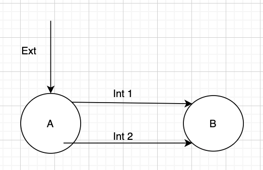
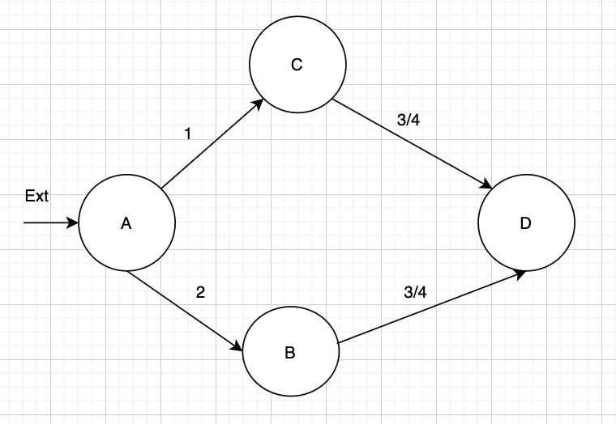
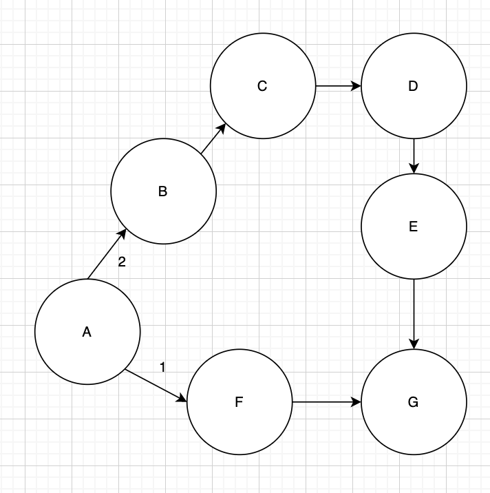
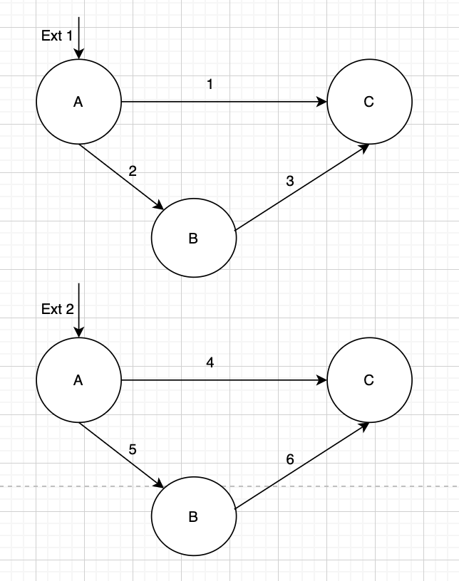

## LT Guarantees

This very complex topic (the complexity arises due to sharding), and there is no consensus in the community yet on what kind of guarantees we can count on. So everything described below has not yet been confirmed with documentation.

The examples below are described for cases when all contracts are in the same workchain, but in unknown shards (in the same shard or different ones, it doesn’t matter).

Guarantees of message delivery order are built on LT guarantees. And of course, everything is described in Nikolai's WP, but so far there is no certainty that the Rust node is doing everything right.

LT - Logical time. This is the logical time when a transaction or message was created.

The main idea here is that the LT of an entity is always greater than the LT of all the entities on which it depends.

That is, if the LT of the block in which the transaction occurs is 1, then the LT of the transaction of this block is at least 2. The LT of the first message created from this transaction is at least 3, the LT of the second is at least 4, and so on.

### Delivery order for two contracts:

When a contract receives incoming messages, it is guaranteed that it will receive them strictly in ascending order of the LT of those messages. That is, if we send two messages from the same transaction, the one that was sent first will be received first. If two messages are sent by different transactions, then the one that was sent first will be received first (the LT of the second transaction is greater than the first).

 

In this case, too, Int 1 will come first, but only if Ext 1 happens before Ext 2 (if you send two external messages at the same time or close in time, there is no guarantee regarding the order in which they will be added into the block).

 

 

Complicated cases: 

**There is no consensus on whether or not you can count on this, so USE ONLY IF YOU UNDERSTAND WHAT YOU ARE DOING 100%, otherwise you should only use delivery order guarantees for two contracts:**

**(This may change after new consensus)**

If we send two messages from contract A, and message 1 is sent before message 2, then message 1 will arrive earlier than any other message generated by message 2, as in the example below, Int 1 will always arrive before Int 3.

 

If you have more than 3 contracts, then the order of delivery is mostly undefined.

For all other cases, you definitely shouldn’t count on this if you don’t consider yourself a super expert in LT and node operation. **Below I will demonstrate several cases where the delivery order is not defined.**

 
 

here the order is not defined, G can receive a message from any of the chains first.

 
 

This is a more complicated example. If Ext 1 happens before Ext2, but they occur close to each other in time, then 1 arrives before 3 and 4, but we don't know in which order C will receive messages 3 and 4.

